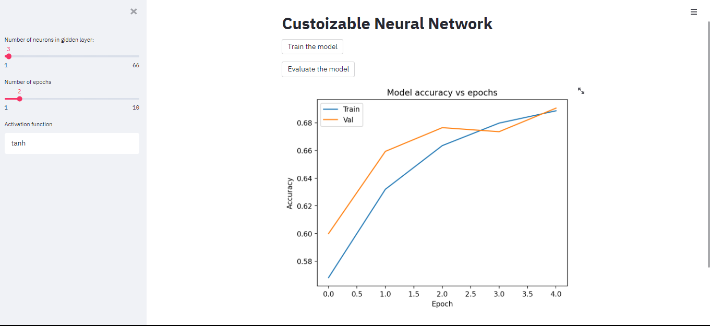

<h1>Custoizable Neural Network</h1>

<h2>About the dataset:</h2>

The MNIST dataset is an acronym that stands for the Modified National Institute of Standards and Technology dataset.

It is a dataset of 60,000 small square 28×28 pixel grayscale images of handwritten single digits between 0 and 9.

<h2>About the task: </h2>

The task is to classify a given image of a handwritten digit into one of 10 classes representing integer values from 0 to 9, inclusively. 

used Sequential model  with bach of layers, built deployed used streamlit.

And the app is Custoizable for number of neurons, number of epochs, and activation function.

<h2>How it works</h2>
To use streamlit you have to create an env to work in:
<ol>
<li>Go to your directorty.</li>
<li>open the cmd and type:</li>
    - py -m venv .env
    - .env\Scripts\activate
<li>3- To run the streamlite app, type:</li>
    - streamlit run yourscript.py 
</ul>

